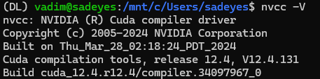

# *PyTorch* (*CUDA*) installation guide for *WSL2* with *cuDNN* and *TensorRT*
## 1. [<b>Install WSL2</b>](https://learn.microsoft.com/en-us/windows/wsl/install)

To install specific version of WSL2 run:
```bash
wsl --list --online
```
Choose the version you want to install and run (example for *Ubuntu 24.04*):
```bash
wsl --install Ubuntu-24.04
```

## 2. Update WSL2
Enter *WSL2* shell:
```bash
wsl -d Ubuntu-24.04
```
Change working directory:
```bash
cd ~
```
Update the system:
```bash
sudo apt update
sudo apt upgrade -y
```

## 3. Install conda
Download [<b>Miniconda</b>](https://docs.anaconda.com/miniconda/) for Linux (check your architecture: `x86_64`, `aarch64` or `s390x64`):
```bash
wget https://repo.anaconda.com/miniconda/Miniconda3-latest-Linux-x86_64.sh
```
Install Miniconda:
```bash
bash Miniconda3-latest-Linux-x86_64.sh
```
>Do you wish to update your shell profile to automatically initialize conda?  
>`yes`

**Re-open shell**

## 4. Install build-essential
```bash
sudo apt install build-essential
```

## 5. Install CUDA toolkit
Download [<b>CUDA toolkit</b>](https://developer.nvidia.com/cuda-toolkit-archive), for example, I will install `CUDA Toolkit 12.4.1` for `x86_64`.

Linux -> $YOUR_ARCHITECTURE -> WSL-Ubuntu -> 2.0 -> runfile (local)

```bash
wget https://developer.download.nvidia.com/compute/cuda/12.4.1/local_installers/cuda_12.4.1_550.54.15_linux.run

sudo sh cuda_12.4.1_550.54.15_linux.run
```

**accept -> Install**

**Add to PATH**

```bash
nano ~/.bashrc
```
Add the following lines to the end of the file:
```
export PATH=/usr/local/cuda-12.4/bin${PATH:+:${PATH}}
export LD_LIBRARY_PATH=/usr/local/cuda-12.4/lib64${LD_LIBRARY_PATH:+:${LD_LIBRARY_PATH}}
``` 


**CTRL+O (save) -> Enter -> CTRL+X (exit)**

```bash
source ~/.bashrc
```

Check if CUDA toolkit is installed correctly:
```bash
nvcc -V
```  


## 6. Install cuDNN
Download [<b>cuDNN</b>](https://developer.nvidia.com/cudnn-archive). I will install `cuDNN 9.2.1` to match `CUDA Toolkit 12.4.1` and *PyTorch* requirements.

Linux -> $YOUR_ARCHITECTURE -> Ubuntu -> 22.04 -> deb (local)

```bash
wget https://developer.download.nvidia.com/compute/cudnn/9.2.1/local_installers/cudnn-local-repo-ubuntu2204-9.2.1_1.0-1_amd64.deb

sudo dpkg -i cudnn-local-repo-ubuntu2204-9.2.1_1.0-1_amd64.deb
```
**Next step you should copy from shell output**:


Install *cuDNN*
```bash
sudo apt-get update
sudo apt-get -y install cudnn-cuda-12
```

## 7. Install *PyTorch* and *TensorRT*
```bash
conda create -n DL python=3.11.9

conda activate DL

python -m pip install torch torch-tensorrt tensorrt --extra-index-url https://download.pytorch.org/whl/cu124

pip install "nvidia-modelopt[all]" --extra-index-url https://pypi.nvidia.com
```
<b>TensorRT installation may take a long time (5-15 min), just wait</b>

Check dependencies:
```bash
pip check
```
If you have next error:

Fix dependencies:
```bash
pip install tensorrt-cu12-bindings==10.1.0 tensorrt-cu12-libs==10.1.0
pip check
```


## 8. Check if everything is installed correctly
```bash
python -c "import torch; import torch_tensorrt as trt; print('CUDA is available:', torch.cuda.is_available()); print('cuDNN is available:', torch.backends.cudnn.is_available()); print('Torch-TensorRT version:', trt.__version__)"
```


Delete pip cache:
```bash
pip cache purge
```